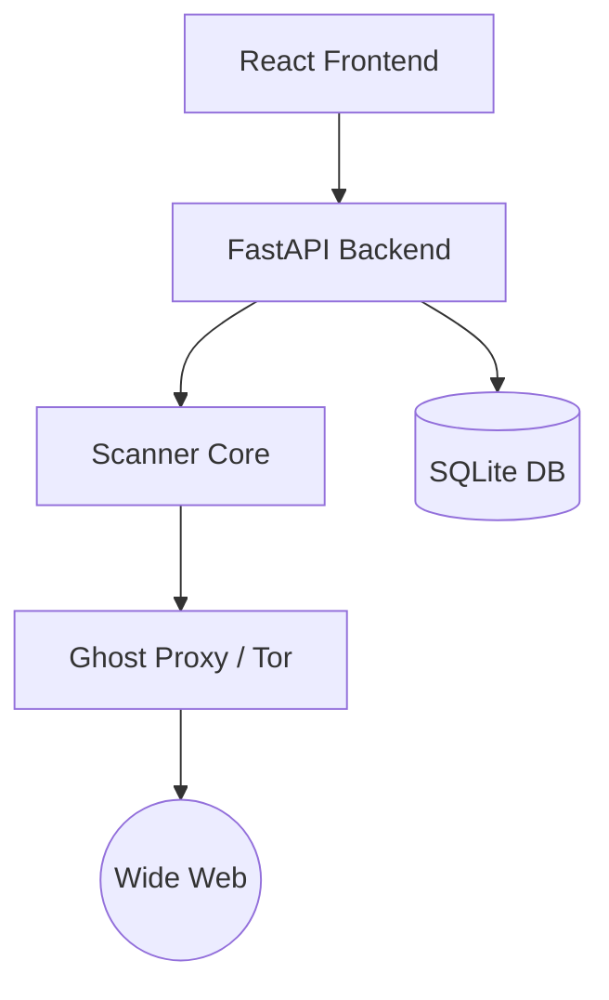

# GhostScan 📡🛡️

**GhostScan** is an advanced network reconnaissance and global explorer tool designed for security professionals and enthusiasts. It combines multi-threaded scanning capabilities with anonymous proxy support and a modern, unified interface.

## 🚀 Features

- **Global Explorer:** Autonomously discover and scan public IP addresses using AI-driven brainstorming.
- **Tor Integration:** Scan targets anonymously via the Tor network using the Ghost Proxy.
- **Unified Architecture:**
  - **Backend:** Python/FastAPI for high-performance scanning and data processing.
  - **Frontend:** React/Vite for a responsive, real-time native GUI.
- **Persistent Database:** SQLite integration for tracking discovered nodes and scan history.
- **Native Controller:** Integrated launch and management scripts for seamless operation.

## 🏗️ Architecture



## 🛠️ Getting Started

### Prerequisites
- Python 3.10+
- Node.js & npm
- Tor (configured correctly for proxy usage)

### Installation
1. Clone the repository:
   ```bash
   git clone https://github.com/georgesojan/GhostScan.git
   cd GhostScan
   ```
2. Install Backend dependencies:
   ```bash
   pip install -r requirements.txt
   ```
3. Install Frontend dependencies:
   ```bash
   cd frontend && npm install
   ```

### Launching
Use the provided launch script to start the system:
```bash
bash launch.sh
```

## 🛡️ License
This project is for educational and authorized security testing purposes only.

---
**Maintained by georgesojan** 📡
